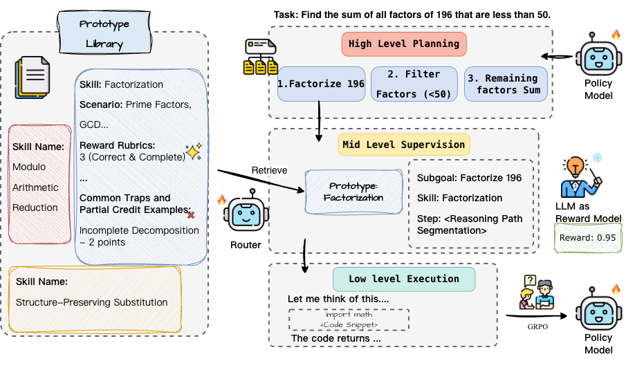
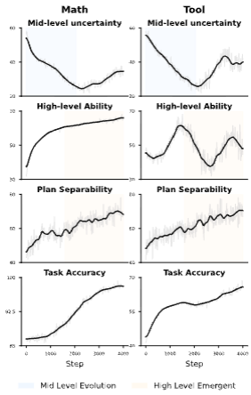

## SCRIBE: Structured Mid-Level Supervision for Tool-Using Language Models

This is the official repository of the paper [SCRIBE: Structured Mid-Level Supervision for Tool-Using Language Models](https://arxiv.org/abs/2601.03555).

- If you find our work helpful and it has been of any assistance to you, we would greatly appreciate it if you could kindly cite it:
  
```
@article{jiang2026scribe,
  title={SCRIBE: Structured Mid-Level Supervision for Tool-Using Language Models},
  author={Jiang, Yuxuan and Ferraro, Francis},
  journal={arXiv preprint arXiv:2601.03555},
  year={2026}
}
```

## 🚀 Introduction

Training reliable tool-augmented agents remains a significant challenge due to the difficulty of credit assignment in multi-step reasoning. While Process-level Reward Models (PRMs) offer a potential solution, standard LLM-based judges often provide inconsistent signals because they lack granular, task-specific rubrics to disentangle high-level planning from low-level execution. In this work, we propose SCRIBE (Skill-Conditioned Reward with Intermediate Behavioral Evaluation), a reinforcement learning framework that intervenes at a novel mid-level abstraction. SCRIBE anchors reward modeling in a curated library of Skill Prototypes, transforming open-ended LLM evaluation into a constrained verification task. By routing subgoals to specific prototypes, we provide the judge with precise rubrics that significantly reduce reward variance. Empirical results demonstrate that SCRIBE achieves state-of-the-art performance across reasoning and tool-use benchmarks; notably, it improves the AIME25 score of a Qwen3-4B model from 43.3% to 63.3% and substantially enhances success rates in complex multi-turn tool interactions. Furthermore, our analysis of training dynamics characterizes a co-evolution between levels, where mid-level skill mastery serves as a precursor to the emergence of strategic high-level planning. Finally, we show that SCRIBE is additive to low-level tool optimizations, offering a scalable and complementary approach to building more autonomous and reliable agents.

<div style="text-align: center;">
  
</div>


## 📄 Get Started

### 📝 Setup
- Firstly, install the required environment:
```
# Training env (for LoRA)
python -m venv train_env
source train_env/bin/activate
pip install -r requirements/train.txt

# Evaluation env 
python -m venv eval_env
source eval_env/bin/activate
pip install -r requirements/eval.txt

```
- Next, get and fill all the required API. In this work, we use [GPT-5-mini](https://platform.openai.com/docs/models/gpt-5-mini).
- Also, install tools for training and evaluation: [Unsloth-GRPO](https://unsloth.ai/docs/get-started/unsloth-notebooks), and [lm-evaluation-harness](https://github.com/EleutherAI/lm-evaluation-harness).
  
### 💻 Models

We use [Qwen3-4B-Instruct-2507](https://huggingface.co/Qwen/Qwen3-4B-Instruct-2507) for our main experiment. Please first get the access of that model.

### 📥 Data

Will release after paper get accepted.


## ⛳️ Run

### Reasoning Path Decomposition and Pruning

- Run the following command:
```
  python3 split_verify.py
```

### Main Experiment

- With the training data prepared:
- First run the following command to train the student models:
```
  bash scripts/run_all.sh
```


<div style="text-align: center;">
  
</div>


