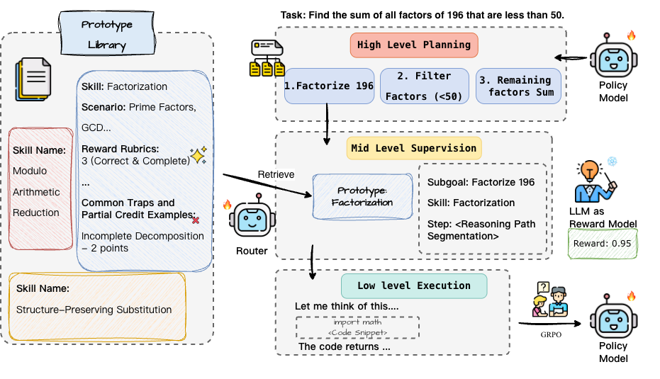
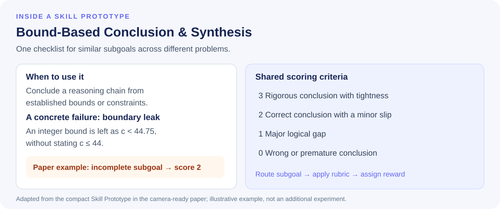
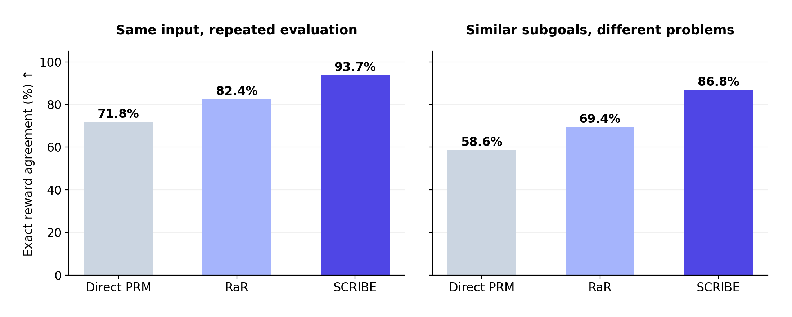

<div align="center">

# SCRIBE
### Learning Reusable Skill Rubrics for Process Reward Models

**[Yuxuan Jiang](https://yuxuanjiang1.github.io/) · Francis Ferraro**<br>
University of Maryland, Baltimore County

[](https://2026.emnlp.org/)
[](https://arxiv.org/abs/2601.03555)
[](slides/SCRIBE_EMNLP2026.pdf)
[](LICENSE)

**[Overview](#overview) · [Skill rubric example](#what-does-a-skill-rubric-look-like) · [Results](#results) · [Resources](#resources-and-release-status) · [Citation](#citation)**

</div>

## News

🎉 **SCRIBE has been accepted to the EMNLP 2026 Main Conference!**

This homepage follows the camera-ready paper, **SCRIBE: Learning Reusable Skill Rubrics for Process Reward Models**. The earlier preprint circulated under the title *SCRIBE: Structured Mid-Level Supervision for Tool-Using Language Models*.

## Overview

> **Build a rubric for a reusable skill, then apply it across problems.** SCRIBE turns open-ended LLM judging into structured, subgoal-level process evaluation.

An LLM judge can assign different rewards to similar reasoning errors. Instance-level rubric methods make evaluation criteria explicit, but their rubrics are constructed separately for each problem and can depend on the quality of reference answers.

**SCRIBE**—**S**kill-**C**onditioned **R**eward with **I**ntermediate **B**ehavioral **E**valuation—organizes reasoning around reusable **Skill Prototypes**. Each prototype specifies when a skill applies, what successful execution looks like, and how common mistakes affect its score. Similar subgoals can therefore share the same evaluation criteria across different problems.

<p align="center">
  
</p>

*Overview figure from the camera-ready paper.*

### How it works

1. **Build reusable rubrics.** Decompose trajectories into ⟨subgoal, skill, step⟩ triples, cluster related reasoning behaviors, and construct prototypes with scoring criteria and common failure modes.
2. **Route and evaluate.** A trained router maps student-generated subgoals to prototypes. An LLM judge applies their rubrics, assigning subgoal scores from 0 to 3.
3. **Optimize the policy.** Aggregate the subgoal rewards and combine them with final-answer rewards for GRPO training. Periodically refresh the prototype library as the policy evolves.

Rubric construction does **not** require golden reference answers. This does not remove the final-answer reward: the reported training setup combines process and final-answer rewards with weights of 0.3 and 0.7.

## What does a skill rubric look like?

For a subgoal that concludes from mathematical bounds, “is the reasoning good?” becomes a concrete check: **did the model respect the variable's domain and finish the conclusion?** The paper's boundary-leak example assigns partial credit when an integer bound is left incomplete.

<p align="center">
  
</p>

*Adapted from the paper's compact prototype. The reusable object is the skill rubric, rather than a particular problem's answer.*

## Results

### Reasoning and tool use

Selected camera-ready results are shown below. All values are percentages; higher is better. The paper reports pass@1 averaged over eight independent runs, with BFCL v4 evaluated using the official scripts and the benchmark snapshot updated on November 3, 2025.

| Policy model | Method | MATH500 | AIME25 | BFCL v4 Overall |
|---|---|---:|---:|---:|
| Qwen3-4B-Instruct-2507 | Base | 89.1 | 43.3 | 33.0 |
| | PRM | 92.3 | 51.7 | 44.6 |
| | RaR | 90.7 | 43.3 | 46.2 |
| | **SCRIBE** | **95.8** | **63.3** | **51.3** |
| LLaMA-3.2-3B-Instruct | Base | 40.8 | 1.7 | 21.5 |
| | PRM | 48.3 | 6.7 | 24.8 |
| | RaR | 54.6 | 6.7 | 27.0 |
| | **SCRIBE** | **63.4** | **15.8** | **30.8** |

On Qwen3-4B, SCRIBE improves AIME25 by **20.0 percentage points over the base model** and BFCL Overall by **5.1 points over RaR**. The paper includes additional baselines and BFCL category breakdowns.

### More consistent reward judgments

The camera-ready analysis evaluates both repeated judgments of the **same input** and judgments of **similar reasoning behaviors across different problems**.

<p align="center">
  
</p>

*Redrawn from the camera-ready consistency tables. Repeated evaluation uses 10 independently sampled judgments per input. Cross-instance evaluation uses 50 manually matched groups of subgoals sharing a reasoning pattern or failure type. These are reward-agreement measures, not task accuracy.*

Compared with RaR, SCRIBE increases cross-instance agreement from **69.4% to 86.8%**, while reducing the average score gap from **0.57 to 0.24** on the 0–3 reward scale.

## Resources and release status

| Resource | Link |
|---|---|
| Paper / preprint history | [arXiv](https://arxiv.org/abs/2601.03555) |
| EMNLP presentation | [PDF slides](slides/SCRIBE_EMNLP2026.pdf) |
| Editable presentation | [PowerPoint slides](slides/SCRIBE_EMNLP2026.pptx) |
| English speaker script | [Script](slides/SCRIBE_EMNLP2026_speaker_script.md) |
| Editable reward illustration | [draw.io source](resource/SCRIBE_reward_revised.drawio) |
| Homepage figures and plotting source | [Assets](assets/) |

**Currently available:** presentation materials, illustrations, and the result summaries above. **Not included in the current repository:** training/evaluation implementation, datasets, trained router checkpoints, or the full prototype library. The slides explain the method; they are not an executable reproduction package. Protocol examples in the presentation are illustrative.

Questions about the method or release materials are welcome in [GitHub Issues](https://github.com/YuxuanJiang1/SCRIBE/issues).

## Citation

The entry below cites the arXiv preprint using its original title. The camera-ready title is shown at the top of this page; the citation can be updated when the final proceedings entry is available.

```bibtex
@article{jiang2026scribe,
  title={SCRIBE: Structured Mid-Level Supervision for Tool-Using Language Models},
  author={Jiang, Yuxuan and Ferraro, Francis},
  journal={arXiv preprint arXiv:2601.03555},
  year={2026},
  url={https://arxiv.org/abs/2601.03555}
}
```

## License

This repository is distributed under the [Apache License 2.0](LICENSE).
